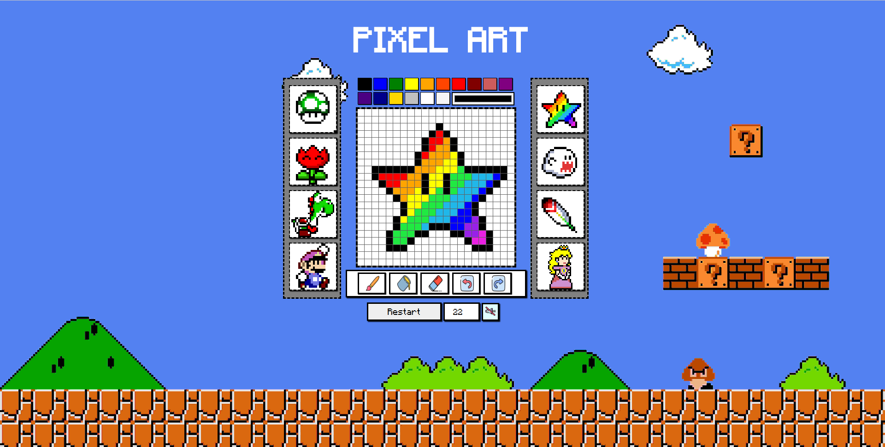

# Pixel Art

Deleitem-se com esse meu primeiro projeto da vida! São espetaculares quase 5000 linhas de HTML puro e primitivo! Brincadeiras à parte, é um projeto de grande orgulho pois foi meu primeiro contato com programação. Dentro do curso de desenvolvimento web da trybe, no módulo de fundamentos, o projeto ganhou certo destaque por ter saído do proposto e pela dedicação no design.

## :page_with_curl: Tecnologias Utilizadas

* :octocat: HTML5
* :octocat: CSS (raw)
* :octocat: Javascript ES6+
* :octocat: Github Pages

## :desktop_computer: Principal

## :page_with_curl: Resumo

Esta aplicação permite desenhar um Pixel Art, escolher a divisão dos quadros, apagar, pintar, riscar e se divertir.

Para ver a aplicação rodando, acesse: https://guga-santos.github.io/

Para rodar a aplicação localmente, é necessário a extensão Live Server do VsCode.
